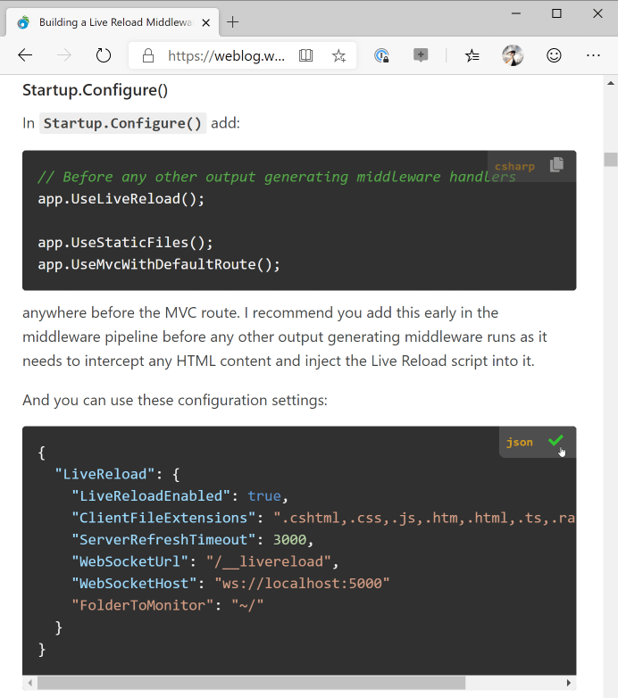

#  HighlightJs Copy Code Badge Component
This small JavaScript library complements the [highlightJs Syntax Highligher](https://highlightjs.org/) by providing a badge in the top right corner of highlightJs code snippets.

* Shows active Syntax for the code block
* Allows copying the code block to Clipboard

You can install it [from NPM](https://www.npmjs.com/package/highlightjs-badge):

```ps
npm install highlightjs-badge
```


* [Codepen Example](https://codepen.io/rstrahl/pen/RwNZGBE)
* [HighlightJs-Badge Blog Post](https://weblog.west-wind.com/posts/2019/Dec/30/A-HighlightJs-Copy-Code-Badge-Component)

Here's what the code badge looks like attached to several highlightjs code blocks:



This small, single JavaScript file component can be loaded after highlightJS has been loaded. It's fully self-contained. Add the script, call the `window.highlightJsBadge()`, and you're up and running without any other configuration or dependencies.

### Usage
To use this library is very simple - you add a script file and call `highlightJsBadge()` after highlightJS has been applied.

The following is a typical configuration for both highlightJs and highlightJs-Badge:

```html
<!-- load highlightjs first -->
<link href="scripts/highlightjs/styles/vs2015.css" rel="stylesheet" />
<script src="scripts/highlightjs/highlight.pack.js"></script>

<!-- then add this badge component -->
<script src="scripts/highlightjs-badge.min.js"></script>

<script>
    // apply HighlightJS
    var pres = document.querySelectorAll("pre>code");
    for (var i = 0; i < pres.length; i++) {
       hljs.highlightBlock(pres[i]);
    }
    
    // add HighlightJS-badge (options are optional)
    var options = {   // optional
       contentSelector: "#ArticleBody",
       
       // CSS class(es) used to render the copy icon.
       copyIconClass: "fas fa-copy",
       // CSS class(es) used to render the done icon.
       checkIconClass: "fas fa-check text-success"
    };
    window.highlightJsBadge(options);
</script>
```
### Options Available
The following options are available to pass into the function, which control the behavior of the badge generation.

```js
var options = {
    // the selector for the badge template
    templateSelector: "#CodeBadgeTemplate",

    // base content CSS selector that is searched for snippets
    contentSelector: "body",

    // Delay in ms used for `setTimeout` before badging is applied
    // Use if you need to time highlighting and badge application
    // since the badges need to be applied afterwards.
    // 0 - direct execution (ie. you handle timing
    loadDelay: 0,

    // CSS class(es) used to render the copy icon.
    copyIconClass: "fa fa-copy",     
    // optional content for icons class (<i class="fa fa-copy"></i> or <i class="material-icons">file_copy</i>)
    copyIconContent: "",

    // CSS class(es) used to render the done icon.
    checkIconClass: "fa fa-check text-success",
    checkIconContent: "",

    // function called before code is placed on clipboard that allows you inspect and modify
    // the text that goes onto the clipboard. Passes text and code root element (hljs).
    // Example:  function(text, codeElement) { return text + " $$$"; }
    onBeforeCodeCopied: null        
};
```

### Styling
The default script includes default styling that should work great with dark themed syntax, and fairly well with light themed syntax.

You can customize the styling and the layout of badge by either overriding existing styles or by:

* Overriding styles
* Copying complete styles and template into page

#### Overriding styles
The easiest way to modify behavior is to override individual styles. The stock script includes a hardcoded style sheet and you can override the existing values with hard CSS overrides.

For example to override the background and icon sizing you can:

```css
<style>
    .code-badge {
        padding: 8px !important;
        background: pink !important;
    }
    .code-badge-copy-icon {
        font-size: 1.3em !important;
    }
</style>
```

#### Replace the Template and Styling Completely
Alternately you can completely replace the template and styling. If you look at the source file at the end of the file is a commented section that contains the complete template and you can copy and paste that template into your HTML page - at the bottom near the `</body>` tag.

```html
<style>
    "@media print {
        .code-badge { display: none; }
    }
    .code-badge-pre {
        position: relative; 
    }
    .code-badge {
        display: flex;
        flex-direction: row;
        white-space: normal;
        background: transparent;
        background: #333;
        color: white;
        font-size: 0.8em;
        opacity: 0.5;
        border-radius: 0 0 0 7px;
        padding: 5px 8px 5px 8px;
        position: absolute;
        right: 0;
        top: 0;
    }
    .code-badge.active {
        opacity: 0.8;
    }
    .code-badge:hover {
        opacity: .95;
    }
    .code-badge a,
    .code-badge a:hover {
        text-decoration: none;
    }

    .code-badge-language {
        margin-right: 10px;
        font-weight: 600;
        color: goldenrod;
    }
    .code-badge-copy-icon {
        font-size: 1.2em;
        cursor: pointer;
        padding: 0 7px;
        margin-top:2;
    }
    .fa.text-success:{ color: limegreen !important}    
</style>
<div id="CodeBadgeTemplate" style="display:none">
    <div class="code-badge">
        <div class="code-badge-language">{{language}}</div>
        <div title="Copy to clipboard">
            <i class="{{copyIconClass}} code-badge-copy-icon"></i>
        </div>
     </div>
</div>
```

This is the same template that the library internally holds and injects into the page, but if `#CodeBadgeTemplate` exists in the document then that is used instead of the embedded template. When using your own template no styling is applied. so you neeed to include both the CSS and the `CodeBadgeTemplate`.

You can optionally separate out the CSS into a separate file and only include the `#CodeBadgeTemplate` `<div>` element - that's sufficient for your custom template and styling to kick in.

### Requirements
This library is a self-contained JavaScript file so there are no direct external dependencies. However, there are a couple of requirements:

#### Some ES6 Usage
The library uses a couple of ES6 functions, so if you plan on using this with Internet Explorer you'll need to add these polyfills:

* [Object.assign](https://developer.mozilla.org/en-US/docs/Web/JavaScript/Reference/Global_Objects/Object/assign#Polyfill)
* [String.trim](https://developer.mozilla.org/en-US/docs/Web/JavaScript/Reference/Global_Objects/String/Trim#Polyfill)

#### FontAwesome by Default, Custom Icon Overrides
The library by default also uses [FontAwesome icons](https://fontawesome.com/icons?from=io) for the copy and check icons. The icon styles used work with Font Awesome 4 and 5 (both free and pro). 

The default rendering uses:

```html
<i class="fa fa-copy"></i>
```
The icon is changed to `fa-check` check after content's been copied for 2 seconds.

If you want to use different icons you can use separate styling for the icon classes. For example to change the icons used you affect the `class` attribute on the icon setting. 

For example to use Material Icons:

```javascript
var options = {
        // CSS class(es) used to render the copy icon.
        copyIconClass: "material-icons",  
        copyIconContent: "copy_files",
        
        // CSS class(es) used to render the done icon.
        checkIconClass: "material-icons",
        checkIconContent: "check"
};
window.highlightJsBadge(options);
```

### License 
Licensed under the MIT License. There's no charge to use, integrate or modify the code for this project. You are free to use it in personal, commercial, government and any other type of application.


### Version History
  
### v0.1.7

* **Add onBeforeCopyCode hook**  
You can provide an `options.onBeforeCopyCode` function to intercept the pasted text and fix up the text before it is pasted into the clipboard.

### v0.1.6

* **Fix up `lang-javascript` Syntax Names**  
Fix up `lang-csharp` style syntax tags generated by various tools like DocFx and properly display the syntax. Same fixup is also applied to `language-css` style syntax.

### v0.1.5

* **Turn off code badge in Print Media Style**  
Added media class so that the code-badge is not shown when printing is active for print or PDF generation.

* **Fix Internet Explorer missing Line Feeds**  
Fixed issue where IE 11/10 was not properly picking up line breaks in the copied text content. Still useful for those of us using the Web Browser control in Windows. Fixed by using `textContent` instead of `innerText`.

* **Badge Position on Scrolled Content**   
Fixed issue where the badge overlay would not properly stay right aligned when a code block was scrolled horizontally. Fixed by moving `position:relative` up to the `<pre>` tag **via code**. Unfortunately this style feature is not directly settable via CSS so the relative style gets hardcoded when the badge is added to the page.


